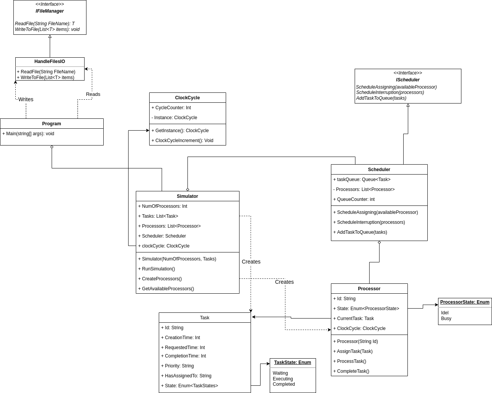

# CPU Simulator

CPU Simulator is a project implemented in C# Programming Language using object-oriented programming and SOLID principles.

# Dependecies

- .net 6.0
- Newtonsoft.Json 13.0.3

# Used Design Patterns

- Singelton
- Builder

# Project Implementation

- Class HandleFilesIO which handle Read input data "NumberOfProcessors and Tasks", as well as write output data to file.
- Simulator Class that takes the data from ReadFile method in order to create the tasks and processors, this class has been implemented to act as a Director class for the whole project and uses the Builder Design Pattern.
- Scheduler Class which is responsible for adding the tasks to the queue based on creation time and sorting the Queue based on tasks' priority with helping of QueueSorting Interface, in addition to creating the processors, in the end, it schedules the tasks inside the queue to the processors and executing them. (This class uses the Singelton Design Pattern)
- Processor Class runs with helping of the scheduler class, it assigns tasks that come from the queue to the processor iff the processor state is Idle and changes the state to Busy, executes the currently assigned task based on the clock cycle and if the currently assigned task is completed its execute it changes the state to Idle.

## Class Diagram



## Cloning

Using HTTPS

```bash
git clone https://github.com/ahmadshawakri/CPU-Simulator.git
```

Using SSH Key

```bash
git clone git@github.com:ahmadshawakri/CPU-Simulator.git
```

## Run Application

```bash
dotnet run
```
